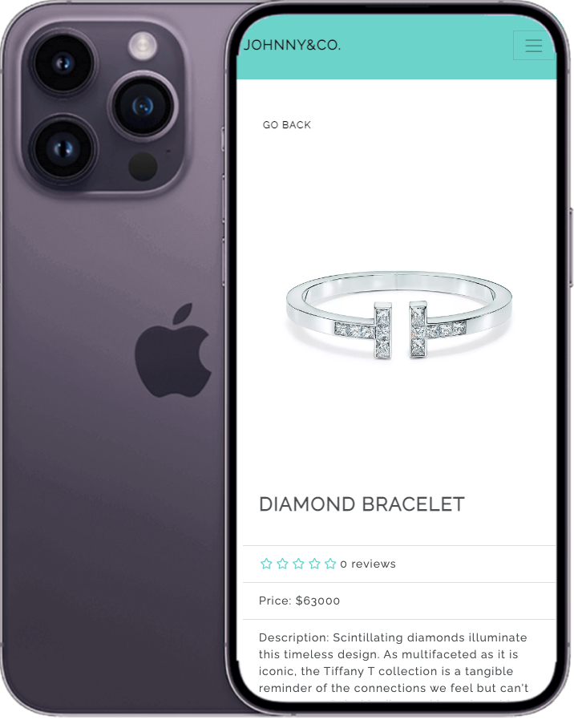

# Johnny&Co.

> [Johnny&Co.](https://haxalabs.com/) is an eCommerce website created with MERN stack 💍

## Features

- 🧑🏻‍💼 Admin product management
- 👨‍👩‍👦 Admin user management
- 🎁 Admin order management
- 💳 PayPal / credit card integration
- ⭐️ Product reviews / ratings
- 🔍 Search product
- 🛒 Shopping cart
- 👩🏻 User profile with orders
- 🚚 Checkout process (shipping, payment method, etc)

## Docs

📄 Read the [Google Docs](https://docs.google.com/document/d/1cCmYlvT7zN1VVJ4X7mH-5sxntNe4PvYZ5K1fgKZWyMg/edit?usp=share_link) that explains how to approach coding problems and solve it.

## Tech

    
    
    
    
    
    
    

